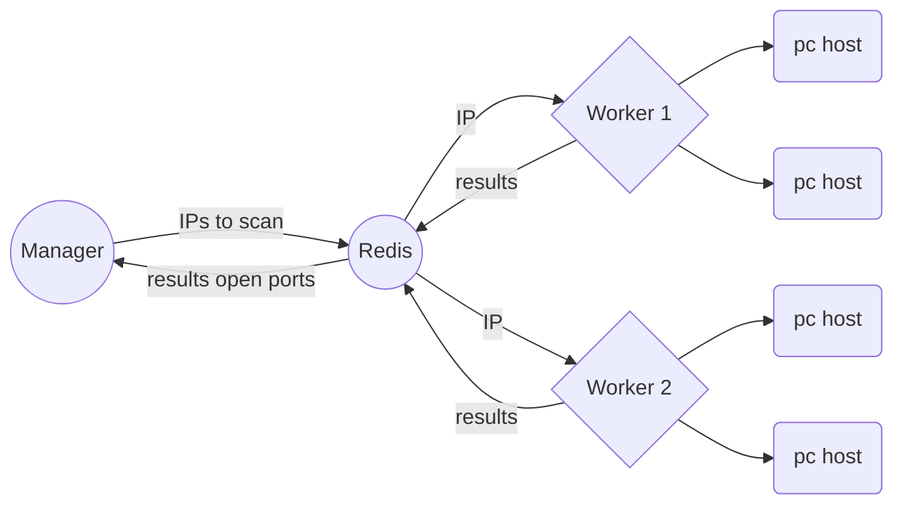

# go-network-distributed-scanner

A simple network scanner showing open ports, like Nmap but in Go, multi-threading and distributed. 

It's possible to specify a domain, subdomains, IPv4 addresses, or even networks/IP mask pairs.

Redis is used as a centralized information and message passing system.

Only scan the first 1024 ports TCP. UDP scan is implemented but not enabled due to many false positives.

For educational purposes only.

WIP! A lot of refactoring is needed.


# How



## Using

Just clone the repository and do a "make":

```bash

git clone https://github.com/nireitdev/go-network-distributed-scanner.git
cd go-network-distributed-scanner.git
cp config.yml.example  bin/config.yml
make

```

Make will compile the "./worker" and "./manager" into *bin* directory.
Then copy the example config.yml into /bin. 
Modify and set the config to connect a remote redis server.

Run "./worker" on remote servers and "./manager" on a local machine to send ips to scan.

```
./manager www.example.com  192.168.0.1
./manager 192.168.0.0/24
```

## ToDo

- Save results in a DB for late analysis (mysql,sqlite,etc)
- Replace redis server with a custom application with gRPC/SSL

