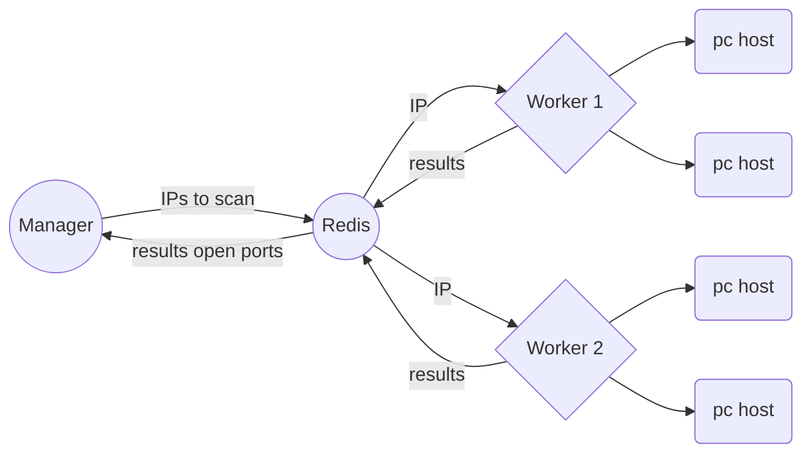

# go-network-distributed-scanner
A simple network scanner showing open ports, like Nmap but in Go , multi-threading and distributed.

Redis it is used as centralized informtacion and mesagge passing.

For educational purposes only.

Only scan first 1024 ports TCP.
UDP scan is implemented, but not enabled due many false positives.

WIP! A lot of refactoring is needed.

# How

## Using

## ToDo

- Save results in a DB for late analysis (mysql,sqlite,etc)
- Replace redis server with a custom application with gRPC/SSL

