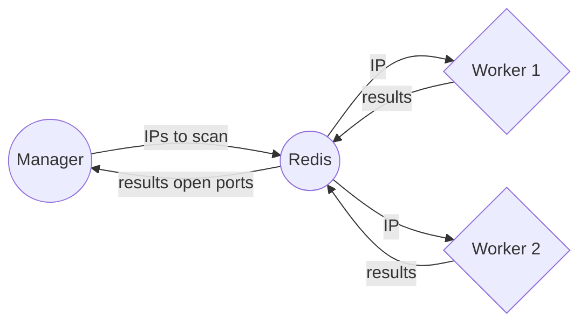

# go-network-distributed-scanner
A simple network scanner showing open ports, like Nmap but in Go , multi-threading and distributed.

For educational purposes only.

WIP! A lot of refactoring is needed.

# How

## Using

## ToDo

- Save results in a DB for late analysis (mysql,sqlite,etc)
- Replace redis server with a custom application with gRPC/SSL

